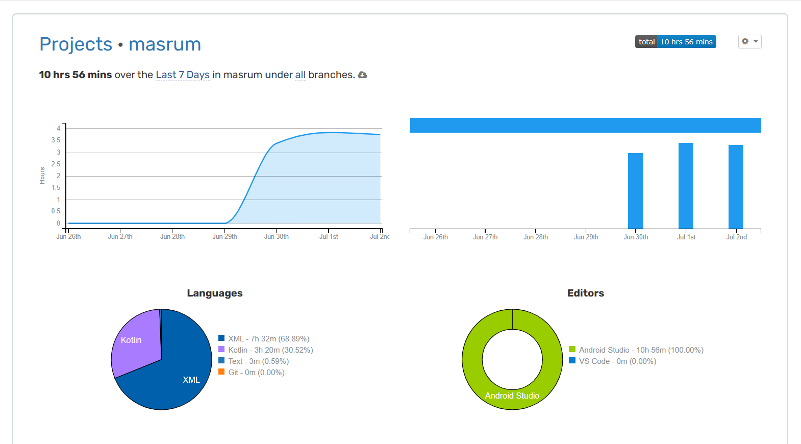

# Masrum

## What's this?

Masrum is an Android app that can help you identify whether a mushrom is edible or not, using the
ANN machine learning algorithm, it uses the dataset owned by @uciml on Kaggle.
[See here](https://kaggle.com/datasets/uciml/mushroom-classification).

## Disclaimer

This is for learning purposes only, not for use in production environments.
